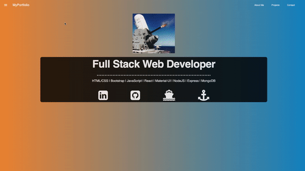

# React Portfolio

## Description

My Portfolio

## Table of Contents

  - [Description](#description)
  - [Demo](#demo)
  - [Technologies](#technologies)
  - [License](#license)
  - [GitHub Repo,Profile, Quesitons](#github-repoprofile-questions)

### Demo

[View My Profile](https://radiant-scrubland-01965.herokuapp.com/) Live on Heroku

## Technologies
  - React
  - React-mdl
  - Bootstrap
  - Material-UI
  - Heroku

## Contributing
1. Fork it!
2. Create your branch: `git checkout -b your-branch-name-here`
3. Add and commit your changes
4. Push to your branch
5. Submit a pull request

## License

## GitHub Repo,Profile, Questions

* [Repository](https://github.com/brandt-fricker/newPortfolio)
* [GitHub Profile](https://github.com/brandt-fricker)
* Any questions, comments, or concerns please feel free to contact me, all my info can be found [here](https://drive.google.com/file/d/1lZC64xhP2PnV-DXlreSIA11vyq-aKmZ2/view?usp=sharing)